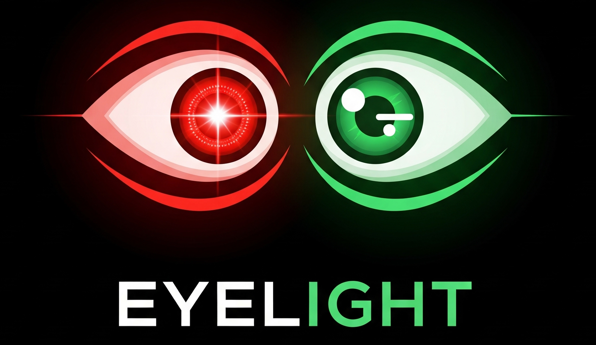

# Eyelight---Tubes-Multimedia

## Deskripsi Project
Eyelight adalah game yang terinspirasi dari permainan Red Light, Green Light namun menggunakan deteksi mata sebagai penentu pergerakan pemain. Saat lampu merah (red light), pemain harus menutup mata unntuk berhenti bergerak. Lalu, saat lampu hijau aktif, pemain boleh membuka mata untuk bergerak maju. Game menggunakan kamera/webcam untuk mendeteksi apakah mata pemain terbuka atau tertutup secara real-time. Suara berupa musik juga digunakan untuk memberi tahu pemain kapan boleh membuka mata (saat green light) dan kapan harus menutup mata (saat red light). Jika musik berhenti, maka permainan berada di kondisi red light, dan sebaliknya. Jika pemain membuka mata saat lampu merah, mereka dinyatakan kalah dan posisi direset ke tempat awal.

## Data Kelompok
- Nama Lengkap: Albi R. Suseno
- NIM: 120140095
- ID Github: 120140095-AlbiR

## Logbook
05-05-2025
- Buat repository github

27-05-2025
- Update readme
- Buat prototype game
- Buat requirement.txt

28-05-2025
- Update readme
- Tambah assets (image & sound)
- Hapus violation counter
- Tambah fitur song cue

29-05-2025
- Fungsi-fungsi kompleks dipisah ke file berbeda
- Sound cue dapat berhenti secara random

30-05-2025
- Resize window
- Buat start menu
- Buat logo

31-05-2025
- Buat laporan
- Update readme
- Minor fix

## Requirements, cara instalasi dan penggunaan program
### Requirements
- Python 3.8+
- Webcam
### Cara instalasi 
- Download repositori github https://github.com/120140095-AlbiR/Eyelight---Tubes-Multimedia
- Jalankan command pip install requirements.txt untuk menginstall module yang diperlukan
### Cara menggunakan program
- Buka folder Eyelight---Tubes-Multimedia-main pada VSCode atau terminal
- Jalankan command python eyelight_game.py
- Permainan berhasil dijalankan, gunakan tombol panah atas dan bawah untuk navigasi menu.

## Dokumentasi
- Main menu

- How to play

- In-game

